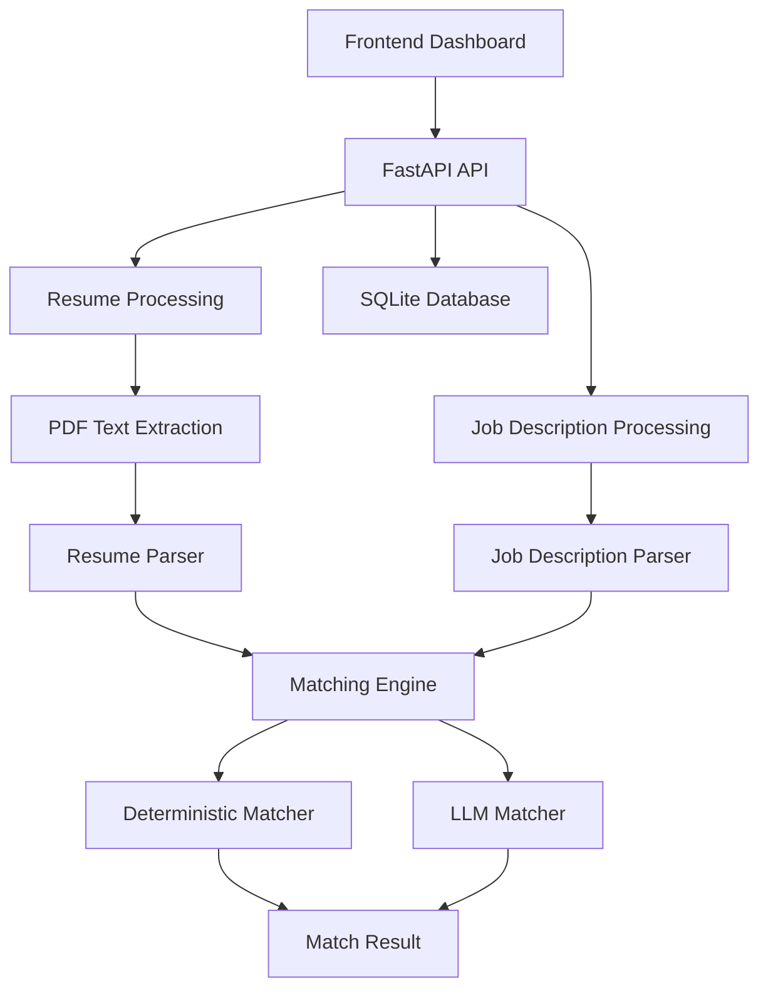
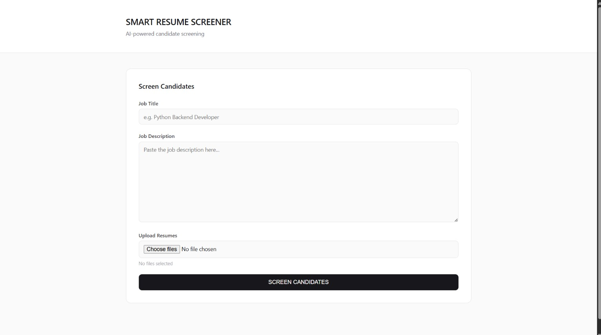
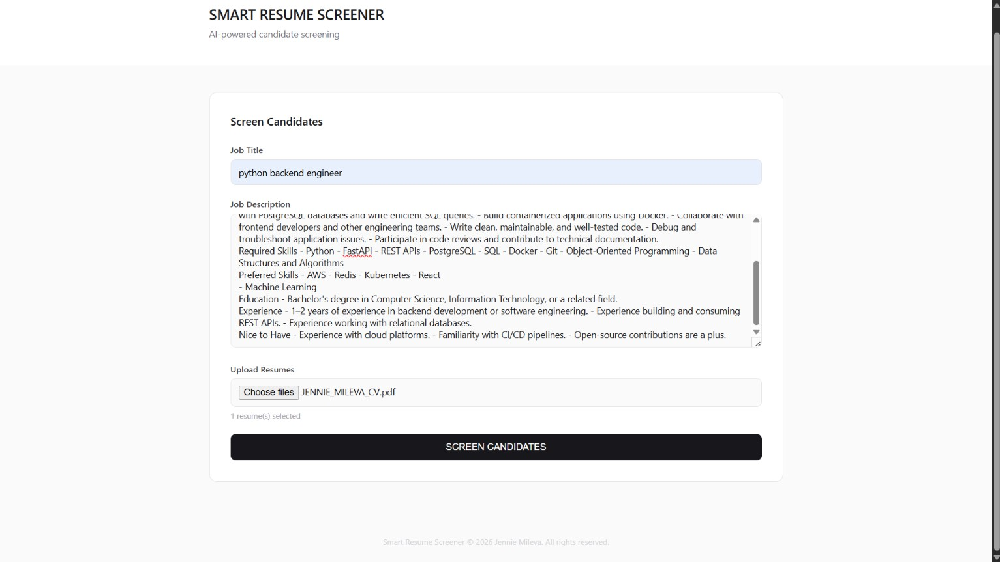
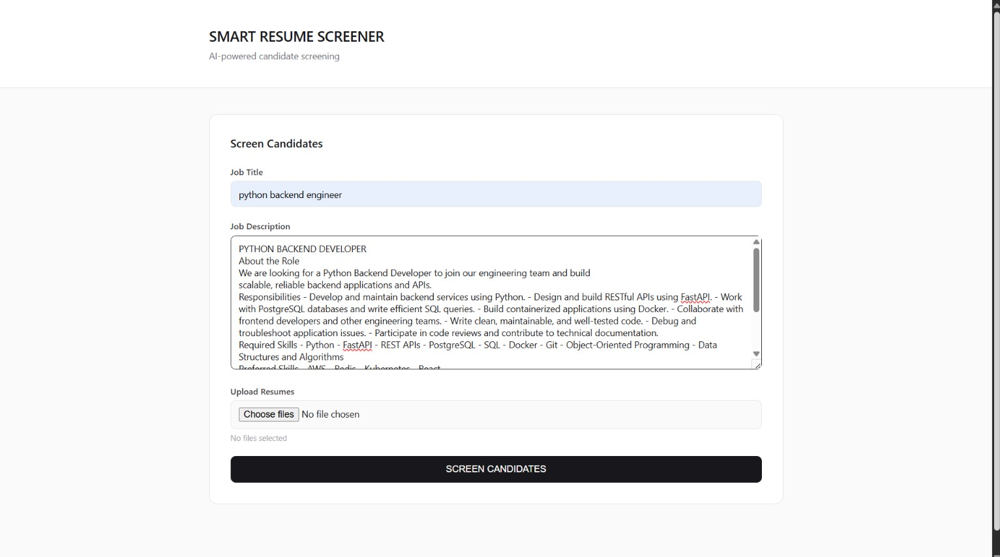
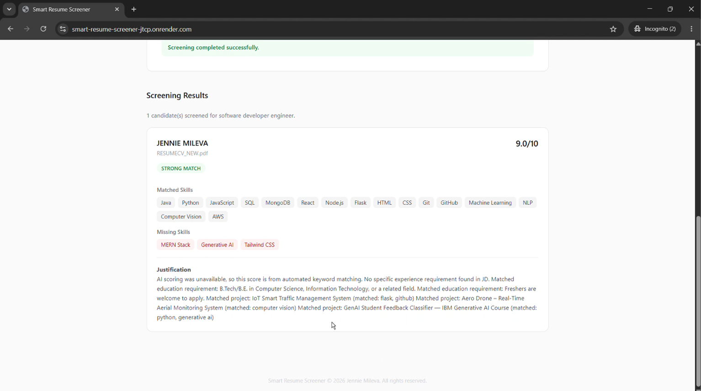
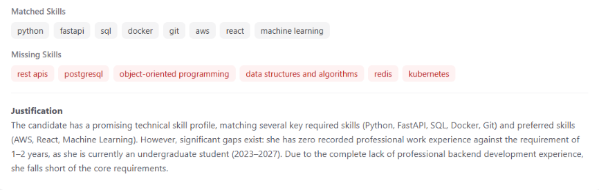
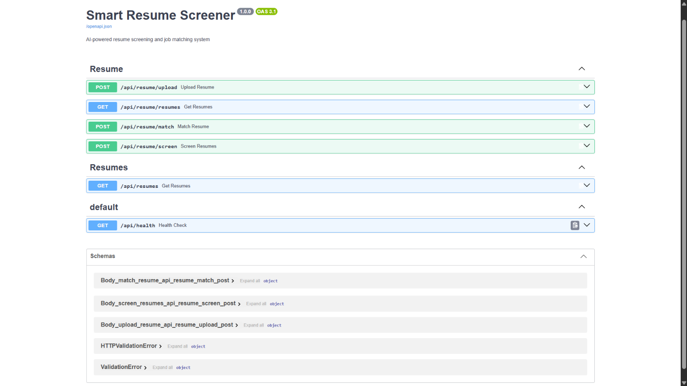

# Smart Resume Screener

## Overview

Smart Resume Screener is an AI-powered candidate screening system. It extracts structured information from PDF resumes, parses job descriptions into structured requirements, and evaluates candidate-job fit using a combination of deterministic keyword/skill matching and LLM-based semantic evaluation (Google Gemini). Recruiters can screen a single resume or multiple candidates against one job description and get a ranked, explained match score.

## Features

* Extract text from PDF resumes
* Parse resumes into structured candidate information
* Parse job descriptions into structured requirements
* Match candidates against required and preferred skills
* Evaluate experience, education, projects, and responsibilities
* Generate candidate match scores and recommendations
* Screen multiple candidates against a single job description
* Store candidate and resume information using SQLite
* Validate LLM responses before using them
* Graceful fallback to deterministic matching if the LLM is unavailable
* Web dashboard for resume screening

## Tech Stack

* Python
* FastAPI
* SQLite
* SQLAlchemy
* Pydantic
* Google Gemini API
* HTML, CSS, JavaScript
* Pytest
* Deployment: Render (backend web service + frontend static site)

## Architecture



This reflects what is actually implemented: every match request runs through the deterministic matcher; the LLM matcher is attempted for semantic scoring, and if it fails (rate limit, network issue, invalid response), the deterministic result is used instead so screening never breaks.

## LLM Approach

The system uses two matching approaches together:

**Deterministic Matching** — a rule-based matcher that evaluates required skills, preferred skills, experience, projects, and responsibilities, producing structured match percentages. This always runs and acts as the reliable fallback.

**LLM Matching** — Google Gemini evaluates the same structured candidate data against the structured job description using a weighted rubric:

* Skills — 40%
* Experience — 30%
* Education — 15%
* Responsibilities / domain alignment — 15%

The final score is a weighted combination of these four category scores, constrained to a 0–10 range. The LLM's JSON output is validated (correct fields, valid recommendation enum, score in range) before it's used — if validation fails or the API call errors out, the app falls back to the deterministic matcher rather than showing a broken result.

## LLM Prompts

The prompt lives separately from application code at `backend/prompts/resume_matching.txt`, so it can be reviewed and edited without touching Python code:

```text
You are an expert technical recruiter.

Evaluate the candidate against the job description.

CANDIDATE:
{candidate_json}

JOB DESCRIPTION:
{job_json}

SCORING RUBRIC:

Calculate four separate category scores from 0 to 10.

1. SKILLS — 40%
Compare the candidate's skills with the required and preferred skills.
Required skills are more important than preferred skills.

2. EXPERIENCE — 30%
Compare the candidate's actual experience with the job's experience requirements.
Do not assume experience that is not explicitly present.

3. EDUCATION — 15%
Compare the candidate's education with the stated education requirements.
Do not assume qualifications that are not provided.

4. RESPONSIBILITIES / DOMAIN ALIGNMENT — 15%
Compare the candidate's experience and projects with the responsibilities
and technical domain of the job.
Only use evidence present in the supplied candidate data.

Calculate the final score using:

final_score =
    (skills_score * 0.40) +
    (experience_score * 0.30) +
    (education_score * 0.15) +
    (responsibilities_score * 0.15)

The final score must be between 0 and 10.

Score guidance:

0-3:
Very poor match. Major required qualifications are missing.

4-5:
Some relevant qualifications, but significant gaps exist.

6-7:
Good match. A substantial portion of the important requirements is satisfied.

8-9:
Strong match. Most important requirements are satisfied with relevant evidence.

10:
Exceptional match. Essentially all important requirements are satisfied.

IMPORTANT:

- Do not invent qualifications, skills, experience, education, projects, or responsibilities.
- Base every conclusion only on the supplied candidate and job data.
- Required skills must not be treated as equivalent to preferred skills.
- Missing information must not be treated as evidence that the candidate has the qualification.
- Return valid JSON only.
- The score must be between 0 and 10.

Return exactly this JSON structure:

{
  "score": 0.0,
  "recommendation": "Reject",
  "matched_skills": [],
  "missing_skills": [],
  "strengths": [],
  "justification": ""
}

Recommendation must be one of:

"Strong Shortlist"
"Shortlist"
"Maybe"
"Reject"
```

Flow:

```text
Resume  → structured candidate data (skills, experience, education, projects)
JD      → structured requirements (required/preferred skills, experience, education)
                    ↓
                   LLM
                    ↓
         Validated match analysis
    (score, recommendation, matched/missing
     skills, strengths, justification)
```

## API Endpoints

### Health Check

```text
GET /api/health
```

Returns the API health status.

### Upload Resume

```text
POST /api/resume/upload
```

Uploads a PDF resume, extracts its text, parses the candidate information, and stores the candidate in the database.

### Get Resumes

```text
GET /api/resume/resumes
```

Returns candidates stored in the database.

### Match Resume

```text
POST /api/resume/match
```

Matches one resume against a job description.

### Screen Candidates

```text
POST /api/resume/screen
```

Screens multiple resumes against a single job description and returns ranked candidates.

Full interactive API documentation (Swagger UI) is available at `/docs` on the deployed backend.

## Database

Candidate and resume data is stored in **SQLite** via **SQLAlchemy**, chosen for its zero-setup simplicity, which fits a project of this scope and a free-tier deployment. The database stores:

* Parsed candidate information (name, skills, experience, education, projects) extracted from uploaded resumes
* Resume metadata (filename, upload time)

Note: on Render's free tier, the filesystem is ephemeral, so stored data resets if the instance restarts — acceptable for this project's scope, but a persistent/managed database (e.g. Postgres) would be the next step for production use.

## Setup Instructions

Create and activate a virtual environment:

```bash
python -m venv .venv
```

On Windows:

```bash
.venv\Scripts\activate
```

Install the dependencies:

```bash
pip install -r backend/requirements.txt
```

Create a `.env` file in the project root (see `.env.example`):

```env
GEMINI_API_KEY=your_api_key_here
```

### Running the Backend

From the project root:

```bash
uvicorn backend.app.main:app --reload --port 8000
```

The API will be available at `http://127.0.0.1:8000`, and Swagger docs at `http://127.0.0.1:8000/docs`.

### Running the Frontend

The frontend is located in `frontend/index.html`. Serve it using a local HTTP server:

```bash
python -m http.server 5505 --directory frontend
```

Then open `http://127.0.0.1:5505`. Update `API_BASE_URL` in `frontend/js/app.js` to point at your backend (local or deployed) before running.

## Live Demo

* **Frontend:** [https://smart-resume-screener-jtcp.onrender.com](https://smart-resume-screener-jtcp.onrender.com)
* **Backend API / Swagger docs:** [https://smart-resume-screener-api-xisb.onrender.com/docs](https://smart-resume-screener-api-xisb.onrender.com/docs)

> Note: hosted on Render's free tier, so the backend may take 30–50 seconds to respond on the first request after a period of inactivity (cold start).

**Demo video:** https://youtu.be/vOy1b1pedo8

## Screenshots


### Dashboard


### Resume Upload


### Job Description Input


### Screening Results


### Match Score + Explanation


### Swagger API Docs



## Testing

The project includes tests covering:

* Database operations
* Database services
* Job description parsing
* Resume parsing
* Resume and job description schemas
* PDF extraction
* Matching logic
* Resume upload API
* Matching API
* Candidate screening API

Run the complete test suite with:

```bash
python -m pytest
```

## Error Handling

The API validates common input and processing errors, including:

* Missing files
* Unsupported file types
* Empty files
* Files exceeding the size limit
* Invalid job description files
* Unreadable PDF content
* Missing LLM API configuration
* Invalid LLM responses

If the LLM service is unavailable, the application falls back to the deterministic matcher so screening can continue uninterrupted.

## Limitations

* Resume parsing depends on the structure and quality of extracted PDF text.
* Skill extraction currently uses a controlled vocabulary.
* LLM results depend on the configured model and API availability/rate limits.
* SQLite storage is ephemeral on the current free-tier deployment.
* The system is intended to assist with candidate screening and does not replace human evaluation.

## Future Improvements

* Improve resume parsing for additional formats
* Expand the skill vocabulary
* Add authentication and user management
* Improve candidate ranking and filtering
* Add persistent screening history (managed database)
* Improve dashboard functionality
* Add more comprehensive integration tests