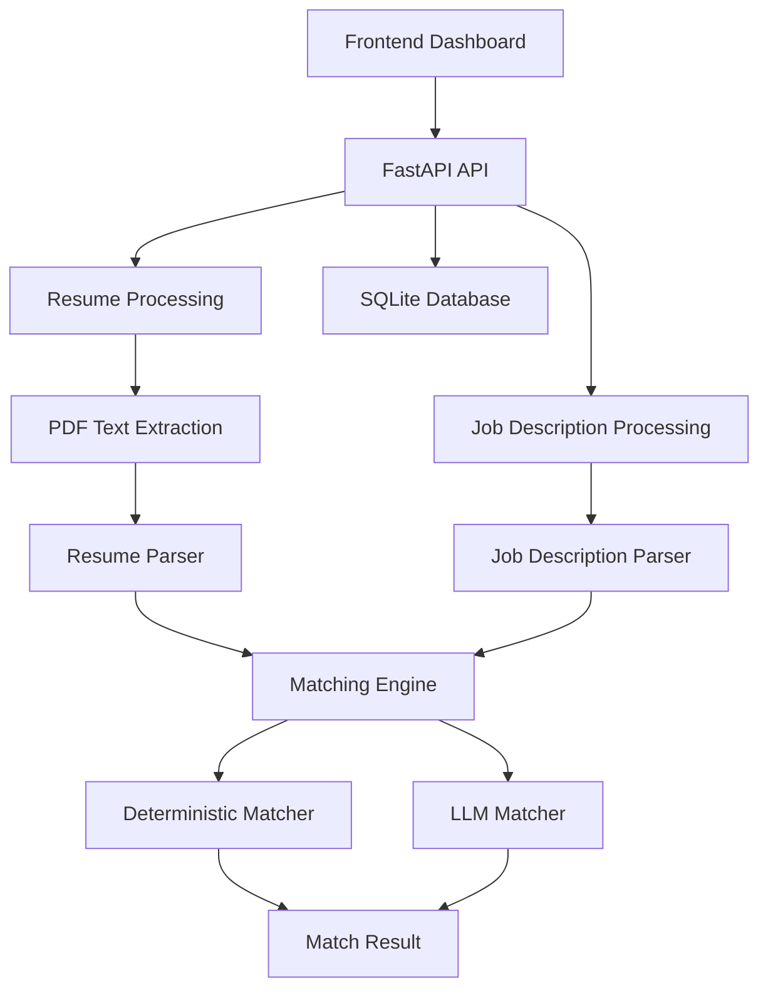

# Smart Resume Screener

An AI-powered resume screening system that extracts structured candidate information and evaluates candidate-job fit using rule-based matching and an LLM.

## Features

* Extract text from PDF resumes
* Parse resumes into structured candidate information
* Parse job descriptions into structured requirements
* Match candidates against required and preferred skills
* Evaluate experience, education, projects, and responsibilities
* Generate candidate match scores and recommendations
* Screen multiple candidates against a single job description
* Store candidate and resume information using SQLite
* Validate LLM responses before using them
* Web dashboard for resume screening

## Tech Stack

* Python
* FastAPI
* SQLite
* SQLAlchemy
* Pydantic
* Google Gemini API
* HTML, CSS, JavaScript
* Pytest

## Project Structure

```text
smart\_resume\_screener/
│
├── backend/
│   ├── app/
│   │   ├── api/
│   │   ├── models/
│   │   ├── schemas/
│   │   ├── services/
│   │   ├── database.py
│   │   └── main.py
│   │
│   ├── prompts/
│   │   └── resume\_matching.txt
│   │
│   └── requirements.txt
│
├── frontend/
│   ├── css/
│   │   └── style.css
│   ├── js/
│   │   └── app.js
│   └── index.html
│
├── tests/
│   ├── test\_database.py
│   ├── test\_database\_service.py
│   ├── test\_jd\_parser.py
│   ├── test\_job\_description\_schema.py
│   ├── test\_matcher.py
│   ├── test\_match\_api.py
│   ├── test\_pdf\_extractor.py
│   ├── test\_resume\_api.py
│   ├── test\_resume\_parser.py
│   ├── test\_resume\_schema.py
│   └── test\_screen\_api.py
│
└── README.md
```

## Architecture



## Setup

Create and activate a virtual environment:

```bash
python -m venv .venv
```

On Windows:

```bash
.venv\\Scripts\\activate
```

Install the dependencies:

```bash
pip install -r backend/requirements.txt
```

Create a `.env` file in the project root:

```env
GEMINI\_API\_KEY=your\_api\_key\_here
```

## Running the Backend

From the project root:

```bash
uvicorn backend.app.main:app --reload --port 8000
```

The API will be available at:

```text
http://127.0.0.1:8000
```

FastAPI Swagger documentation:

```text
http://127.0.0.1:8000/docs
```

## Running the Frontend

The frontend is located in:

```text
frontend/index.html
```

Serve it using a local HTTP server:

```bash
python -m http.server 5505 --directory frontend
```

Then open:

```text
http://127.0.0.1:5505
```

## API Endpoints

### Health Check

```text
GET /api/health
```

Returns the API health status.

### Upload Resume

```text
POST /api/resume/upload
```

Uploads a PDF resume, extracts its text, parses the candidate information, and stores the candidate in the database.

### Get Resumes

```text
GET /api/resume/resumes
```

Returns candidates stored in the database.

### Match Resume

```text
POST /api/resume/match
```

Matches one resume against a job description.

### Screen Candidates

```text
POST /api/resume/screen
```

Screens multiple resumes against a single job description and returns ranked candidates.

## Resume Processing Pipeline

```text
PDF Resume
    |
    v
PDF Text Extraction
    |
    v
Resume Parser
    |
    v
Structured Resume
    |
    +--> Skills
    +--> Experience
    +--> Education
    +--> Projects
    +--> Certifications
    +--> Languages
```

## Matching

The system uses two matching approaches.

### Deterministic Matching

The rule-based matcher evaluates:

* Required skills
* Preferred skills
* Experience
* Projects
* Responsibilities

It produces structured match results and match percentages.

### LLM Matching

The LLM evaluates structured candidate data against the structured job description.

The matching prompt defines separate scoring categories for:

* Skills — 40%
* Experience — 30%
* Education — 15%
* Responsibilities and domain alignment — 15%

The final score is calculated using these weighted categories and is constrained to a range of 0 to 10.

The LLM output is validated before it is returned by the application.

## LLM Prompt

The resume matching prompt is stored separately from the application code:

```text
backend/prompts/resume\_matching.txt
```

Keeping the prompt separate makes it easier to review and modify the LLM instructions.

## Error Handling

The API validates common input and processing errors, including:

* Missing files
* Unsupported file types
* Empty files
* Files exceeding the size limit
* Invalid job description files
* Unreadable PDF content
* Missing LLM API configuration
* Invalid LLM responses

If the LLM service is unavailable during single-resume matching, the application falls back to the deterministic matcher.

## Testing

The project includes tests covering:

* Database operations
* Database services
* Job description parsing
* Resume parsing
* Resume and job description schemas
* PDF extraction
* Matching logic
* Resume upload API
* Matching API
* Candidate screening API

Current test result:

```text
18 passed
```

Run the complete test suite with:

```bash
python -m pytest
```

## Limitations

* Resume parsing depends on the structure and quality of extracted PDF text.
* Skill extraction currently uses a controlled vocabulary.
* LLM results depend on the configured model and API availability.
* The system is intended to assist with candidate screening and does not replace human evaluation.

## Future Improvements

* Improve resume parsing for additional formats
* Expand the skill vocabulary
* Add authentication and user management
* Improve candidate ranking and filtering
* Add persistent screening history
* Improve dashboard functionality
* Add more comprehensive integration tests

